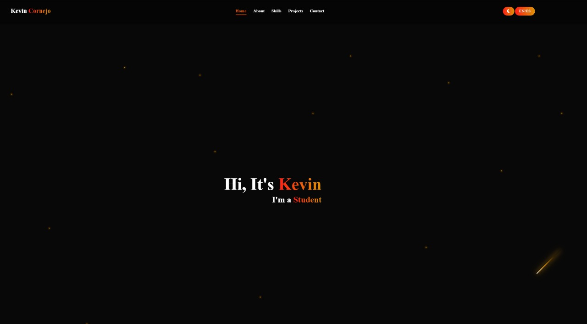
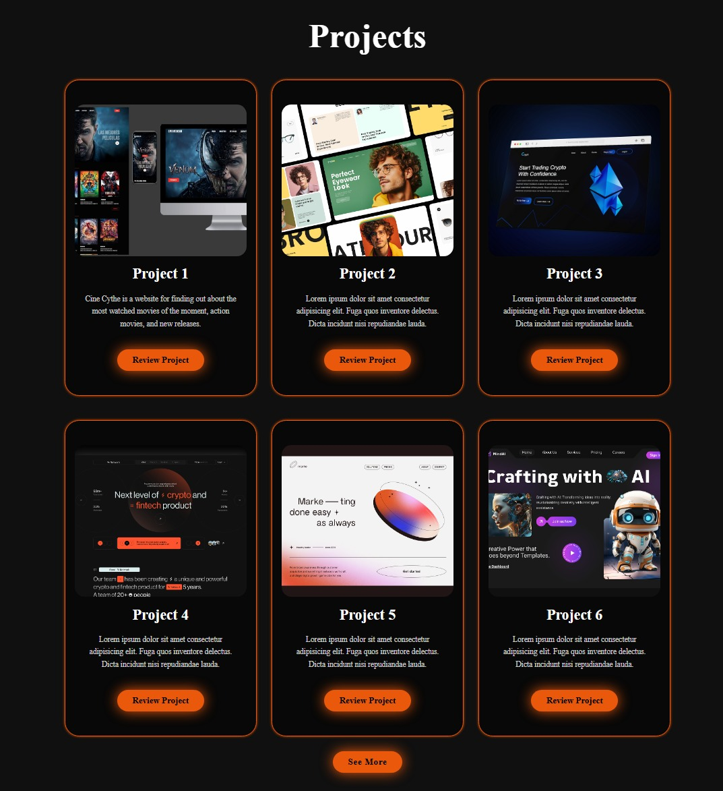

# 🌟 PORTAFOLIOS PERSONAL 🌟

📢 **Bienvenido/a a mi portafolios**

<p align="center">
  
  <br>
  
</p>

---

## 🚀 **Características**

✔️ Diseño responsivo y adaptable para dispositivos móviles
✔️ Animaciones suaves con CSS  
✔️ Menú de navegación interactivo  
✔️ Secciones personalizables (Inicio, Sobre mi, Proyectos, Contacto)  
✔️ FAQ interactivo con JavaScript
✔️ Ver más proyectos

---

## 📂 **Estructura del Proyecto**

```bash
📦 foodfast/
 ┣ 📂 img/            # Recursos de imágenes
 ┣ 📂 css/            # Estilos CSS
 ┣ 📂 js/             # Scripts JavaScript
 ┣ 📜 index.html      # Página principal
```

🛠 Tecnologías Utilizadas

- HTML5
- CSS3 Moderno (Flexbox y Grid, Anidamiento, Variables)
- JavaScript
- FontAwesome
- Google Fonts
- Fontawesome
